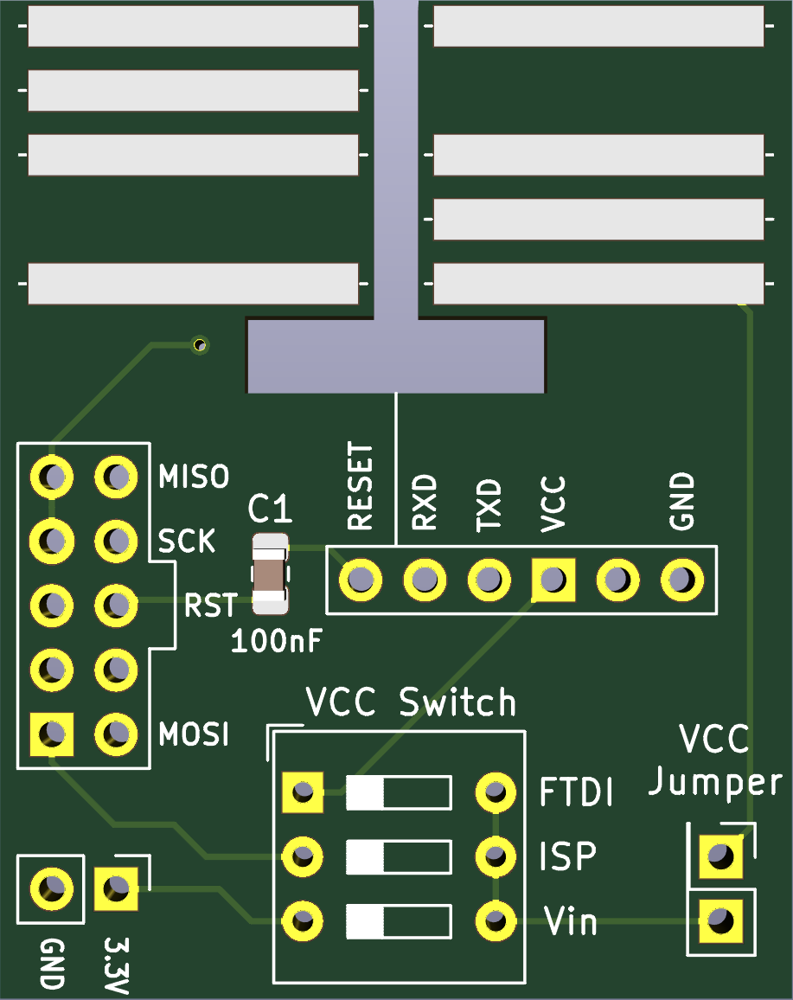
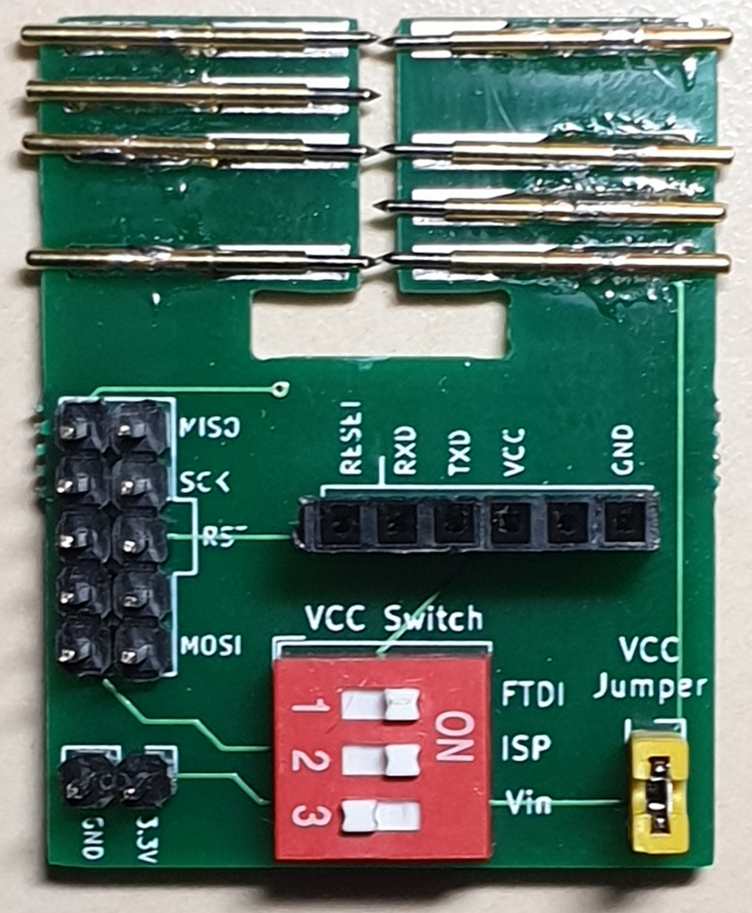
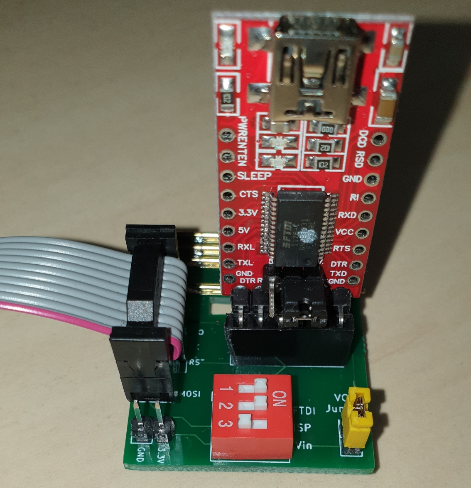

# HMSensor-FlashStation

Hilfsplatine um HMSensor PCBs mit Hilfe von PogoPins einzuspannend und zu flashen.

HMSensor versucht eine universelle Hardware-Basis für AskSin++ Sensoren und Aktoren zu sein.

* [HMSensor PCB](https://github.com/pa-pa/HMSensor) from pa-pa
* [HMSensor Documentation](https://asksinpp.de/Projekte/psi/HMSensor/) on asksinpp.de

Auf dem Testaufbau sind **P75-B1 Pogo Pins** verbaut.

## :bangbang::bug: **Fehler in v1.0** :bangbang:

* RX/TX ist _nicht_ gedreht gegenüber dem USB-UART. Entweder FTDI über JumperWire anschließen und RX/TX drehen oder den Fehler mit Draht auf der Platine beheben.
* RESET Kondensator fehlt

## Features

* DIP-Schalter um die Versorgungsspannungen zu schalten.
* VCC-Jumper: z.B. um eine Strommessung zwischen zu schalten.
* 5x2 Pin ISP Header, kompatibel mit Diamex oder USBasp
* FTDI Header

## Changelog / Notes

### v1.1

* Fehler Behoben im PCB-Design: RX/TX ist _nicht_ gedreht gegenüber dem USB-UART
* RESET Kondensator hinzugefügt

## Lizenz

MIT
