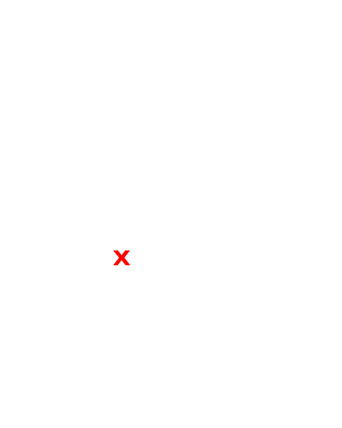
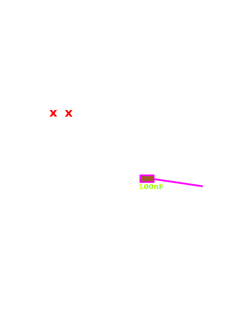
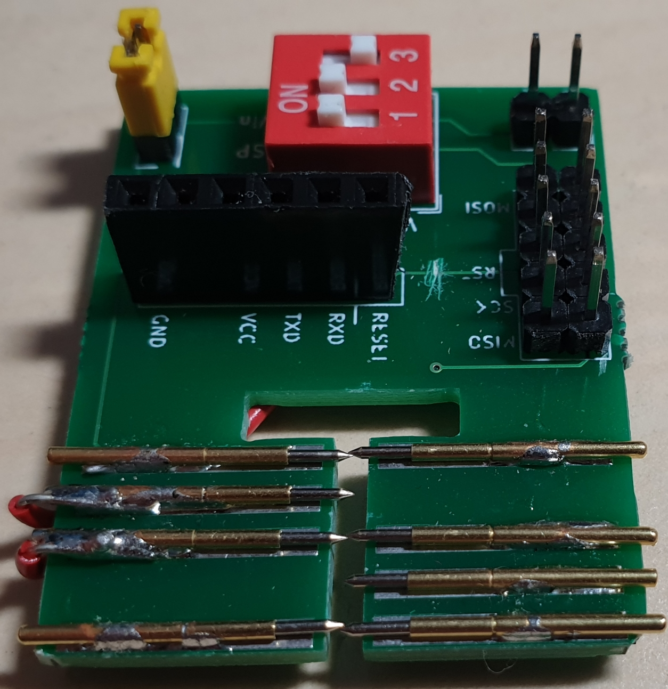
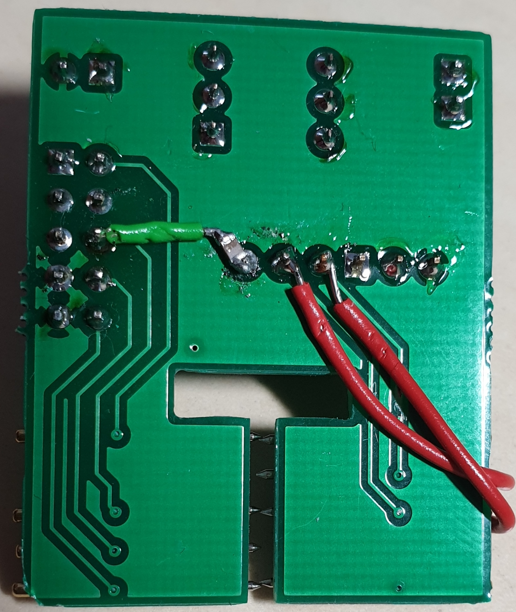

# Bugfix Anleitung für v1.0

Die Version 1.0 der Platine enthält leider zwei Fehler welche aber relativ einfach behoben werden können.

Die Leiterbahnen, im Bild markiert mit **X**, müssen unterbrochen werden.

Zwischen RESET des FTDI-Headers und RESET des ISP Headers wird ein 100nF Kondensator in Reihe geschalten.

Die beiden TX / RX Leitungen jeweils vertauscht verbunden.

